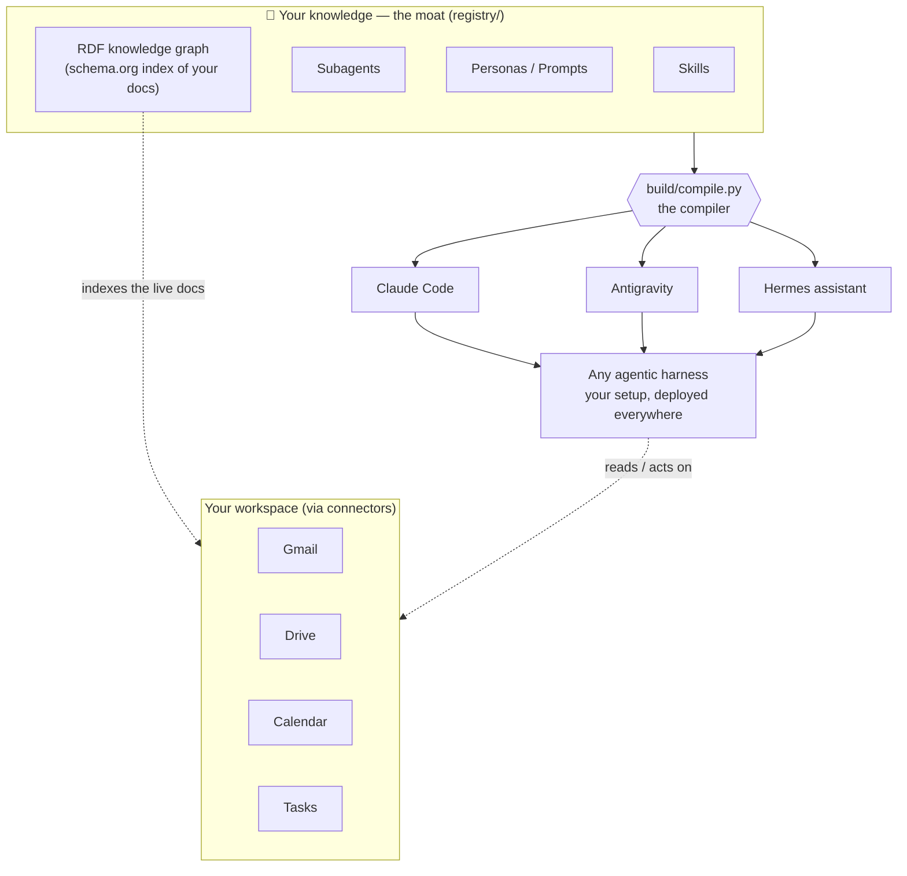
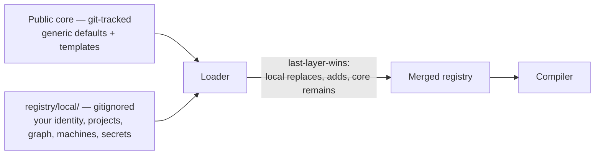

# Mitos

> **Mitos** *(MEE-tohs)* — a human-agentic harness. Named after the Greek word **μίτος**, the thread Ariadne gave Theseus to find his way back out of the labyrinth. Your agents work the maze; Mitos is the thread that keeps them anchored to *your* knowledge, your tools, and your judgment.

Mitos is a **registry and compiler** for your personal agent organization. You author your identity, skills, subagents, project context, and knowledge graph, in plain Markdown and YAML. Mitos compiles that single source of truth into the native format of every AI tool you use — Claude Code, a Hermes assistant, Antigravity, claude.ai, or anything that reads `AGENTS.md` — and deploys it across all your machines. When a tool edits its own copy, Mitos carries that change back to you as a reviewable proposal. Nothing is lost; nothing is committed without your say-so.

The registry is the **moat**: the accumulated, compounding asset of *your* agent capabilities. Execution engines are rented — when a better tool ships, you write one adapter, not a migration.



## What stays public, what stays yours

Mitos ships a **generic public core** — the engine, neutral default identity, example projects, skills, and org templates. Everything personal lives in a **gitignored overlay** at `registry/local/`, loaded *on top of* the core with a documented **last-layer-wins** rule. The same repo is safe to fork in the open without leaking a single private detail.



A local file with the same logical name as a core file **replaces** it; new local files are **added**; untouched core files **remain**. Run `python build/mitos.py init` to set up your overlay — it offers three paths and **never overwrites files you already have**:

1. **Scaffold a fresh one** — name, an org template (`software-firm`, `design-firm`,
   `marketing-firm`), and a workspace backend.
2. **Pull one you already keep on a git hub** — onboard a second machine from your
   `mitos-local` repo (clones your real files instead of generating new ones).
3. **Use files already in `registry/local/`** — finish the install around custom data you
   brought yourself, and optionally publish it to a hub.

Keep your private machine profiles, identity, and projects under `registry/local/`, never in the public tree. To move that overlay across *your own* machines, `mitos sync` keeps it in a git repo synced to a hub you choose — a server you host or a private GitHub repo — see [`docs/lan-sync.md`](docs/lan-sync.md).

## Quick start

Get started in 5 steps. Mitos requires **Python 3.11+** and **Git**. 

All commands below run the project's virtualenv interpreter directly to avoid system conflicts.

### Linux / macOS

```bash
# Step 1: Clone the repository and navigate into it
git clone https://github.com/Peccia/mitos.git && cd mitos

# Step 2: Create a virtual environment and install requirements
python3 -m venv build/.venv
build/.venv/bin/python -m pip install -r build/requirements.txt

# Step 3: Initialize your private overlay (scaffold fresh or pull from a hub)
build/.venv/bin/python build/mitos.py init

# Step 4: Compile and preview your first dry-run deployment (writes nothing)
build/.venv/bin/python build/compile.py compile
build/.venv/bin/python build/compile.py deploy --machine example-linux --dry-run

# Step 5: Launch the Operator Console to review and manage your registry
build/.venv/bin/python build/compile.py review
```

### Windows (PowerShell)

```powershell
# Step 1: Clone the repository and navigate into it
git clone https://github.com/Peccia/mitos.git; cd mitos

# Step 2: Create a virtual environment and install requirements
python -m venv build/.venv
build/.venv/Scripts/python.exe -m pip install -r build/requirements.txt

# Step 3: Initialize your private overlay (scaffold fresh or pull from a hub)
build/.venv/Scripts/python.exe build/mitos.py init

# Step 4: Compile and preview your first dry-run deployment (writes nothing)
build/.venv/Scripts/python.exe build/compile.py compile
build/.venv/Scripts/python.exe build/compile.py deploy --machine example-windows --dry-run

# Step 5: Launch the Operator Console to review and manage your registry
build/.venv/Scripts/python.exe build/compile.py review
```

> [!NOTE]
> The compiler validates machine profiles against your host OS before writing files. Rehearse any cross-machine deployments safely using the `--root <dir>` flag to write into a sandbox directory.
>
> In later commands, `python build/...` is used as shorthand for the virtual environment interpreter (`build/.venv/bin/python` or `build/.venv/Scripts/python.exe`). Ensure you use the venv path when running them.

> [!TIP]
> **Staying up to date.** When you run `mitos.py init` or `mitos.py sync`, Mitos checks whether
> your compiler (`build/`) is behind the official repo and prints a notice if so. Update with
> `git pull origin main`. Your private overlay (`registry/local/`) is gitignored, so pulling never
> touches your own data. To silence the check, set `compiler_sync: false` in your machine
> profile's `sync:` block.

For indexing documents and setting up external document stores (like Google Workspace), see the **[Knowledge Graph & Connectors Guide](docs/connectors/README.md)**.


## Make it yours

`mitos init` scaffolds your overlay's identity and org, but your **machine profiles are yours to
add** — the shipped `machines/example-*.yaml` are templates (`example: true`), not your fleet. To
go live, copy a template into your overlay, rename it, and customize it:

1. Copy a matching template into `registry/local/machines/` and give it a real name, e.g.
   `registry/local/machines/my-pc.yaml`.
2. Edit it: set `name: my-pc`, **remove the `example: true` line**, point `paths:` at your real
   directories, and add a `sync:` block if you sync across machines (see
   [`docs/lan-sync.md`](docs/lan-sync.md)). For what every field and path key means — machine
   profiles, project manifests, and server definitions, field by field — see the
   **[overlay configuration reference](registry/README.md)**.
3. Compile and deploy **your** machine (interpreter path per the Quick start blocks above):

   ```bash
   build/.venv/bin/python build/compile.py compile
   build/.venv/bin/python build/compile.py deploy --machine my-pc
   ```

Once your overlay defines a real machine, `compile` automatically **skips the `example-*`
templates** (and a real `deploy` of a template is refused) — so you only ever build and deploy
your own machines, never the shipped examples.

Similarly, the shipped `example-project` is a sample project manifest (`example: true`). It renders on a fresh clone for the Quick Start, but automatically **steps aside** as soon as you define your own local overlay projects under `registry/local/projects/`. This prevents the sample project from polluting your configured fleet's rosters, graphs, and assistant context trees.


## Core concepts

| Term | What it is |
|---|---|
| **registry/** | The moat. Where you author everything: identity (`identity/`), context (`context/`), skills (`skills/`), subagents (`agents/`), harness-agnostic prompts (`prompts/`), the knowledge graph (`graph/`), project manifests (`projects/`), org templates (`templates/`). |
| **Prompt** | A harness-agnostic reusable text asset in `registry/prompts/<name>.md`. The substrate every harness understands. Skills and agents are progressive enhancement on top. Always available in the **Prompt Library** tab of the console; deployed to harnesses whose `targets/<tool>.yaml` has a `prompts:` block. |
| **Skill resources** | A skill's supporting files — `registry/skills/<name>/examples/` (expected-output samples) and `.../scripts/` (executables Claude can run) — auto-discovered, deployed alongside `SKILL.md`, and bundled into claude.ai zips. Each file adopts/harvests back to its own path, never `SKILL.md`. |
| **Skill extension** | A skill that declares `extends_skill`/`extends_role` in its frontmatter: its body splices into the named parent skill's matching role section **at render time only** (the parent's registry file is never touched) and it never deploys standalone. The Skills & Orgs tab's `+ Extend department` button scaffolds one. |
| **registry/local/** | Your gitignored overlay — private identity, projects, graph, machines, and connections that override the public core. Field-by-field reference: [`registry/README.md`](registry/README.md). |
| **connections/** | MCP server definitions + env templates. Wiring, not content — it deploys on its own `--lane connections`. |
| **target** | An adapter (`targets/<tool>.yaml`): how one tool consumes the registry — what to emit and where. |
| **machine** | A host (`machines/<name>.yaml`): which targets land there and its path keys. Roles are exclusive: `hermes` (the agentic harness) cannot share a machine with a coding harness (`antigravity`/`claude-app`/`claude-code`) — an agentic machine is dedicated to that purpose. Rejected at compile time. `agents-md` itself is not a harness (it's the context format below), so it's never part of this exclusion. |
| **drift policy** | Per-file rule for edits to deployed copies: `protect` (deploy refuses), `harvest` (captured as a proposal), or `generated` (regenerated each deploy). Full mechanics: [managing-state.md](docs/managing-state.md). |
| **inbox/** | The intake queue. Everything a tool proposes lands here as a candidate; **only you** merge it — usually via the operator console. |
| **Operating mount vs. reference mount** | Two agents-md/agentic-graph lanes with opposite edit semantics, easy to conflate because both render a `Projects/<name>/` doc tree. An **operating mount** (`assistant_root`, or a project's `agentic_tree:` below) is the full prose tree — Navigation/Workflows/Skills, roster, dynamic branches — `drift_policy: protect`: edit it, and the edit becomes drift that reconciles back into the registry via `adopt`. A **reference mount** (`agentic_context_root` below) is a roster + per-project doc index generated purely from `registry/graph/`, `drift_policy: generated`: edits are silently overwritten on the next deploy — never an editing surface. Rule of thumb: never hand-edit a reference mount. |
| **assistant_root** | *(operating mount, machine-wide)* The folder (default `~/MitosAgent`) where your assistant's compiled context lives — the proven Hermes combo. It includes `AGENTS.md` (the operating root for routing), `Assistant/AGENTS.md` (one-shot workspace tasks), `Projects/AGENTS.md` (a generated Project Roster — one bullet per deployed project from its manifest's `name:` + optional `description:` — plus the org-domain table), and any custom branches you add — see **dynamic branches** below. Only valid on an agentic (`hermes`) machine. |
| **agentic_tree** | *(operating mount, project-wide)* An optional field on a project manifest — `agentic_tree: <subdir>` — that mounts the SAME operating tree `assistant_root` renders (identical shape: Navigation/Workflows/Skills, full roster, dynamic branches), but rooted at `<local_path>/<subdir>/` inside that one project's own checkout instead of a whole machine. The workstation-side counterpart to `assistant_root`: lets a coding harness like Antigravity operate against a single project the way Hermes operates against a dedicated machine. Workstation-only — a no-op on an agentic machine, which already has the tree at its machine root. |
| **Dynamic branch** | A custom folder under an operating mount's root (e.g. `family/`) that you extend without forking `targets/agents-md.yaml` (not overlayable): drop an `AGENTS.md` under `registry/context/<branch>/` and every file in that folder deploys to `<root>/<branch>/`, auto-listed in the root `AGENTS.md`'s routing table. Branch names may not collide with `Projects`/`Assistant`. Applies identically to a machine mount or a project's `agentic_tree` mount. |
| **agentic_context_root** | *(reference mount, machine-wide)* A workstation path key (`machines/<name>.yaml`) that materializes a lightweight, read-only doc map — a roster plus each project's `Projects/<slug>/AGENTS.md` doc index, generated straight from `registry/graph/` — and is also where `claude-code` auto-clones project repos. No prose, no Workflows/Skills. Independent of `agents-md`/`hermes` — a plain coding workstation can use it. |
| **project checkouts** | Deployed files at each project's `local_path` directory. On **workstation machines** (claude-code without agents-md), Mitos writes a full-context `AGENTS.md` (inline doc index from the knowledge graph + project prose) plus a thin `CLAUDE.md` stub → `@AGENTS.md`. On **Hermes machines** (agents-md also in targets), `CLAUDE.md` carries identity + repo context and the graph materializes separately in the Agentic Context tree. |

## How skills reach a tool

A skill reaching a given tool is governed by **two independent axes** — keeping them separate is
the thing most worth understanding up front:

| Axis | Question it answers | Where you set it |
|---|---|---|
| **Compatibility** | *Can* this skill run on tool X? | the skill's own `targets:` frontmatter |
| **Scope** | Does it deploy everywhere, or only to specific projects? | the skill's own `scope: global \| project` frontmatter (default `global`) |

**Why only Claude Code and Antigravity need the second axis:** Hermes and claude.ai each have one
*global* skills location only — a skill targeting either is simply available everywhere on it, no
scoping possible, so one axis (compatibility) is enough there; they ignore `scope` entirely. Claude
Code and Antigravity each offer **two** surfaces — a personal/global directory
(`~/.claude/skills/`, `~/.gemini/config/skills/`) and a per-project one
(`<checkout>/.claude/skills/`, `<checkout>/.agents/skills/`) — so a skill's `scope` picks which one
it lands in on those two tools.

`scope: project` skills reach a project's checkout via that project manifest's `skills:` list —
**the skill must also list `claude-code` or `antigravity`** (whichever has the project-scoped
surface you want) in its own `targets:`. The manifest decides *which projects*; the skill decides
*which tools*. A Hermes-only skill (one calling an MCP server that isn't in a Claude Code checkout)
lives globally on Hermes and never appears in a project manifest — binding it there is a category
error the compiler rejects. Full mechanics: [authoring-capabilities.md](docs/authoring-capabilities.md#skill-scope-global-vs-project).

Optionally, a target can *curate* its compatible set in one place via `include:`/`exclude:` under
`skills:` in `targets/<tool>.yaml`. Full field details: the `skills` rows in the
[overlay configuration reference](registry/README.md).

## Your first loop

The daily rhythm Mitos is built around: **author once → deploy → a tool refines its copy →
harvest the change back**. Here it is end to end, assuming you've defined a real machine `my-pc`
with the `claude-code` target (see [Make it yours](#make-it-yours)).

**1. Author a capability.** Add a skill to your overlay — a folder holding a `SKILL.md` whose
frontmatter names the tools it's for:

```yaml
# registry/local/skills/changelog/SKILL.md
---
name: changelog
description: "Draft a release changelog from the git log"
targets: [claude-code, hermes]
---
# ...your instructions...
```

**2. Bind it to a project.** Add the skill to that project's `skills:` list so its Claude Code
checkout receives it (compatibility + binding — see
[How skills reach a tool](#how-skills-reach-a-tool)):

```yaml
# registry/local/projects/acme.yaml
skills: [changelog]
```

**3. Compile and preview.** Schema validation is the first test; `--dry-run` prints the plan
without writing a byte:

```bash
python build/compile.py compile
python build/compile.py deploy --machine my-pc --dry-run
```

**4. Deploy for real.** The skill lands at `<acme-checkout>/.claude/skills/changelog/SKILL.md`,
and Claude Code can use it:

```bash
python build/compile.py deploy --machine my-pc
```

**5. A tool refines its own copy.** While working, you or the agent improve that deployed
`SKILL.md` in place. See the divergence any time with the three-way report:

```bash
python build/compile.py diff --machine my-pc
```

Because the skill's drift policy is `harvest`, the next `deploy` **captures** that edit into
`inbox/` as a proposal instead of overwriting it.

**6. Fold it back into the moat.** Accept the proposal in the console (or pull one file straight
back with `adopt`):

```bash
python build/compile.py review     # accept the candidate in the Inbox tab
# or: python build/compile.py adopt <path-to-the-edited-file>
```

The edit flows back into `registry/local/skills/changelog/SKILL.md` — your authored source now
reflects what the tool learned, and the next deploy carries it to **every** machine. Nothing was
committed without you; the registry stayed the single source of truth. Every drift, conflict, and
orphan case is mapped in [Managing your moat's state](docs/managing-state.md).

## The knowledge graph + connectors

Mitos keeps a **lean [schema.org](https://schema.org/) index** of where each project's
authoritative documents live — two types (`Project`, `DigitalDocument`), keyed by document ID,
storing references and short descriptions, never document bodies. It routes an agent to the
*correct, current* document instead of letting it guess. Each document may carry an optional
`additionalType` — a friendly kind (`spreadsheet`, `document`, `pdf`, …) captured from the
store's MIME type at enumeration — rendered beside the modified date in the deployed doc
lines so the agent picks the right tool (sheets vs docs) before touching the store. Absent
on older graphs, and everything still renders — the field is omit-when-absent like `url`
and `keywords`.

You map documents into the graph through **one human-gated valve** — a `kind: graph` candidate
in `inbox/` that you accept in the console. Building it is **three independent stages**, so the
document store is set up once and reused, never coupled to scaffolding.

> **First, know your servers.** A "document store" is one of the MCP servers defined in
> [`connections/servers.yaml`](connections/servers.yaml). Its **name is the top-level key under
> `servers:`** in that file — the shipped default is `gws`. That exact name is what you put in a
> project's `document_store:`. (Note: `mitos connectors` lists connector *backends* like `mcp`,
> not store names — the store names live in `servers.yaml`.)

**Stage 1 — create the project and bind its store.** Pass the store up front so it's wired from
the start (omit `--document-store` and the prompt explains the choice):

```bash
python build/mitos.py project add apdict --document-store gws
```

This writes `registry/local/projects/apdict.yaml` containing, among other fields, the line that
matters here:

```yaml
document_store: gws        # the server from connections/servers.yaml that holds this project's docs
```

Already created the project without a store? **Just edit that one line** in
`registry/local/projects/<slug>.yaml` (change `none` → a server name). That's the whole binding.

**Stage 2 — set up the document MCP server, separately.** Deliberately **not** part of `init`:
you may already run a server, and it may be authless. See [`docs/connectors/`](docs/connectors/)
— e.g. the [Google Workspace guide](docs/connectors/google-workspace.md).

**Stage 3 — map the documents.** Now `connect` knows the store from the manifest:

```bash
python build/mitos.py connect --project apdict
```

It enumerates a scoped folder (interactive picker in a terminal, or pass `--folder-id`),
proposes the documents as a `kind: graph` candidate, and you accept it in the console.
If the project has no `document_store` set, `connect` defaults to the **local-file connector**
— no credentials required; point it at any local directory with `--folder-id /path/to/docs`.

Three connector backends feed the same valve, all **beside** the compiler with lazy, optional
deps (the deterministic verbs never import them):

- **Local-file (`local`)** — walks a local directory with `os.walk`; produces `file://` URLs.
  **The default** when no `document_store` is set — no credentials, no server needed.
- **MCP-backed (`mcp`)** — talks to a document MCP server you already run (per its `graph_enum`
  mapping in `connections/servers.yaml`), so there's no second OAuth. `query_syntax:
  google-drive` enables Drive-specific query construction; any other server uses the generic path.
- **Mock (`mock`)** — in-process demo for tests and dry runs (`--backend mock`).

Nothing writes the graph directly. Inspect any project with
`python build/compile.py graph --project <slug>`.

## Operator console

`python build/compile.py review` opens a localhost web console with four tabs: **Inbox**
(review/accept/reject every candidate against a live diff), **Knowledge Graph** (propose
document mappings and tag efforts with the org domain that governs them), **Skills & Orgs**
(browse, create, and edit skills as cards — including supporting files under `examples/`/
`scripts/` and org-role extensions via `extends_skill`/`extends_role`; each org-domain card
expands into its role tree, Agent-MD folder view, and a `+ Extend department` button per role,
plus `+ ORG` domain creation), and **Prompt Library** (browse, copy, and
compose your registry prose for one-shot use in any chat app — plus a Ctrl/⌘K command
palette that searches all of it). It edits the working tree and never commits
— `git status` shows you exactly what changed. Full guide: [docs/operator-console.md](docs/operator-console.md).

## Commands

Deploy, drift detection, and how you reconcile every state are the heart of Mitos — the full,
scenario-by-scenario guide is **[Managing your moat's state](docs/managing-state.md)**. The quick
reference:

| Command | What it does |
|---|---|
| `compile [--target T]` | Validate the registry and render every machine's targets into `dist/`. |
| `deploy --machine M [--dry-run] [--force] [--root DIR] [--lane L] [--prune]` | Materialize a machine's files; capture drift to `inbox/`; report orphans. |
| `diff --machine M` | Three-way drift report: registry vs. lockfile vs. disk. |
| `adopt <path>` | Pull an in-place edit on a deployed file back into the registry. |
| `harvest [--machine M] [--adopt-all]` | Digest of `harvest`-policy drift — proposals from self-improving tools. |
| `review` | The operator console (localhost). |
| `graph --project <slug>` | Inspect/query a project's knowledge graph. |
| `mitos.py init` / `project add` / `connect` | Scaffold the overlay / create a project (Stage 1) / map its docs into the graph (Stage 3) — the separate, optional entrypoint. |
| `mitos.py sync --machine M [init\|clone --hub URL\|status]` | Set up (`init`/`clone`) or run git-only overlay sync across your machines: pull → deploy → push. |

## Documentation index

Explore our comprehensive guides to mastering Mitos:
- 🧵 **[Documentation Map](docs/README.md)** — The central hub for all deep-dive guides.
- 🔄 **[Managing State & Drift](docs/managing-state.md)** — Understanding deploy, adopt, harvest, and conflict resolution.
- 💻 **[Operator Console](docs/operator-console.md)** — How to use the local `review` web UI to manage your registry.
- 🛠️ **[Target Setup Guides](docs/README.md#tool--target-setup)** — Detailed configuration and support for Claude Code, Claude Desktop, and Antigravity.
- 🔌 **[Workspace Connectors](docs/connectors/README.md)** — Connecting Google Workspace and custom MCP servers.
- 🤝 **[Overlay Synchronization](docs/lan-sync.md)** — How `mitos sync` keeps your fleet in step using Git.

## Project layout

```
registry/        # the moat — your authored content (+ local/ overlay, gitignored)
connections/     # MCP server definitions + env templates
targets/         # one adapter per tool (claude-code, hermes, antigravity, agents-md, claude-app)
machines/        # per-host profiles (example-* templates; copy to registry/local/machines/)
build/           # the compiler, loader, planner, connectors, and tests
docs/            # guides — managing-state.md (deploy/drift), lan-sync.md (sync), connectors/
```

## Contributing

Contributions that keep the public core **neutral** and the overlay contract **clean** are
especially welcome — new skills, target adapters, connector backends, and bug fixes. Keep
personal identity, projects, and machine details in your own `registry/local/` overlay, never
in a PR. See [`CONTRIBUTING.md`](CONTRIBUTING.md), and read the generated
[`AGENTS.md`](AGENTS.md) for the builder context and invariants.

```bash
python build/compile.py compile          # schema validation is the first test
python build/tests/test_compiler.py      # the compiler suite
```

## License

[MIT](LICENSE) © Paul Peccia ([peccia.net](https://peccia.net))
