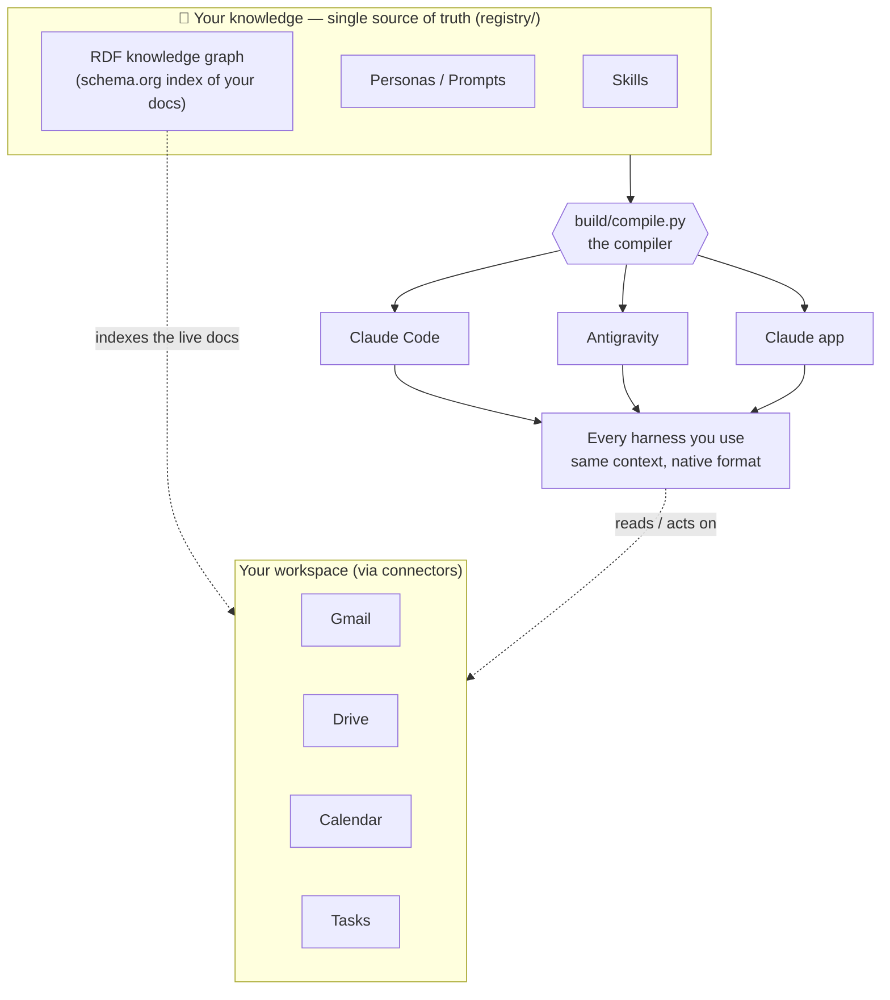
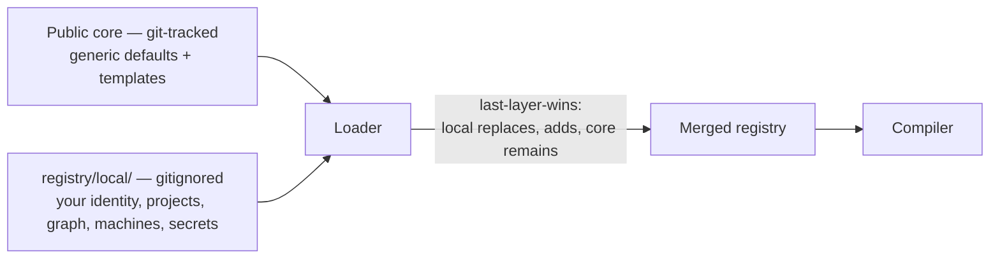

# Mitos

> **Mitos** *(MEE-tohs)* — a human-agentic harness. Named after the Greek word **μίτος**, the thread Ariadne gave Theseus to find his way back out of the labyrinth. Your agents work the maze; Mitos is the thread that keeps them anchored to *your* knowledge, your tools, and your judgment.

### ⚡ Mitos in 60 seconds

You use more than one coding harness, and each one wants its context in its own format. So you
write the same project background into a `CLAUDE.md`, an `AGENTS.md` and a chat window, and
three days later they disagree.

Mitos keeps one copy and compiles it into all of them.

* **Write it once.** Your skills, prompt playbooks, project background and personal details live
  as plain Markdown and YAML under `registry/`.
* **Every harness gets it.** One `deploy` writes the native format each tool expects — Claude
  Code, Antigravity (IDE & CLI), and the Claude app (web + Desktop) — on every machine you own.
* **Edits find their way home.** When you or a tool improves a deployed file in place, Mitos
  notices, captures the change into a review queue (`inbox/`), and folds it back into the
  registry once you accept it. Nothing is silently overwritten and nothing is silently kept.
* **Your documents, indexed.** Point Mitos at a project's folder in Google Drive (or any MCP
  document store — the standard way a tool reaches an outside service) and it builds a map of
  what is in there, which every harness then reads as ordinary context.

The registry is your **single source of truth**: the accumulated, compounding asset of *your* agent capabilities. Execution engines are rented — when a better tool ships, you write one adapter, not a migration.


```mermaid
flowchart TB
    subgraph MOAT["🧵 Your knowledge — single source of truth (registry/)"]
        direction LR
        SKILLS["Skills"]
        PROMPTS["Personas / Prompts"]
        GRAPH["RDF knowledge graph<br/>(schema.org index of your docs)"]
    end

    MOAT --> COMPILE{{"build/compile.py<br/>the compiler"}}

    COMPILE --> CC["Claude Code"]
    COMPILE --> AG["Antigravity"]
    COMPILE --> CA2["Claude app"]

    CC --> HARNESS["Every harness you use<br/>same context, native format"]
    AG --> HARNESS
    CA2 --> HARNESS

    subgraph WS["Your workspace (via connectors)"]
        direction LR
        GM["Gmail"]
        DR["Drive"]
        CA["Calendar"]
        TK["Tasks"]
    end
    GRAPH -. "indexes the live docs" .-> WS
    HARNESS -. "reads / acts on" .-> WS
```

## What stays public, what stays yours

Mitos ships a **generic public core** — the engine, a neutral default identity, and example projects and skills. Everything personal lives in a **gitignored overlay** at `registry/local/`, loaded *on top of* the core with a documented **last-layer-wins** rule. The same repo is safe to fork in the open without leaking a single private detail.


```mermaid
flowchart LR
    CORE["Public core — git-tracked<br/>generic defaults + templates"] --> LOAD["Loader"]
    LOCAL["registry/local/ — gitignored<br/>your identity, projects, graph, machines, secrets"] --> LOAD
    LOAD -->|"last-layer-wins:<br/>local replaces, adds, core remains"| MERGED["Merged registry"] --> COMPILE["Compiler"]
```

A local file with the same logical name as a core file **replaces** it; new local files are **added**; untouched core files **remain**. Run `python build/mitos.py init` to set up your overlay — it offers three paths and **never overwrites files you already have**:

1. **Scaffold a fresh one** — your name, which harnesses this box runs, and (optionally) a
   document store to connect.
2. **Pull one you already keep on a git hub** — onboard a second machine from your
   `mitos-local` repo (clones your real files instead of generating new ones).
3. **Use files already in `registry/local/`** — finish the install around custom data you
   brought yourself, and optionally publish it to a hub.

Keep your private machine profiles, identity, and projects under `registry/local/`, never in the public tree. To move that overlay across *your own* machines, `mitos sync` keeps it in a git repo synced to a hub you choose — a server you host or a private GitHub repo — see [`docs/lan-sync.md`](docs/lan-sync.md).

## Quick start

Get started in 5 steps. Mitos requires **Python 3.11+** and **Git**. 

Steps 1-2 run the project's virtualenv interpreter directly to avoid system conflicts. From
step 3 on, the repo-root `mitos` shim does that for you: it finds `build/.venv`'s interpreter
and routes the verb to the right script, so nothing needs activating and there is one command
to remember.

### Linux / macOS

On Debian/Ubuntu, ensure `python3-venv` is installed: `sudo apt update && sudo apt install -y python3 python3-venv git`.

```bash
# Step 1: Clone the repository and navigate into it
git clone https://github.com/Peccia/mitos.git && cd mitos

# Step 2: Create a virtual environment and install requirements
python3 -m venv build/.venv
build/.venv/bin/python -m pip install -r build/requirements.txt

# Step 3: Initialize your private overlay and machine profile (e.g. named 'my-machine')
./mitos init

# Step 4: Compile and preview your first dry-run deployment (writes nothing)
./mitos compile
./mitos deploy --machine my-machine --dry-run

# Step 5: Launch the Operator Console to review and manage your registry
./mitos review
```

### Windows (PowerShell)

If PowerShell script execution is restricted, run `Set-ExecutionPolicy -Scope CurrentUser RemoteSigned` once.

```powershell
# Step 1: Clone the repository and navigate into it
git clone https://github.com/Peccia/mitos.git; cd mitos

# Step 2: Create a virtual environment and install requirements
python -m venv build/.venv
build/.venv/Scripts/python.exe -m pip install -r build/requirements.txt

# Step 3: Initialize your private overlay and machine profile (e.g. named 'my-machine')
.\mitos init

# Step 4: Compile and preview your first dry-run deployment (writes nothing)
.\mitos compile
.\mitos deploy --machine my-machine --dry-run

# Step 5: Launch the Operator Console to review and manage your registry
.\mitos review
```

> [!NOTE]
> The compiler validates machine profiles against your host OS before writing files. Rehearse any cross-machine deployments safely using the `--root <dir>` flag to write into a sandbox directory.
>
> Mitos operates directly as a script runner (`build/compile.py`, `build/mitos.py`) rather than a packaged CLI. The repo-root shims — `mitos` (Linux/macOS) and `mitos.cmd` (Windows) — are the supported way to call it: they pick the venv interpreter and route the verb to `build/mitos.py` (`init`, `project`, `connect`, `connectors`, `peek`, `sync`, `update`) or `build/compile.py` (everything else). Later commands written as `python build/compile.py <verb>` are the same thing as `./mitos <verb>`; if you invoke the scripts directly, use the venv path (`build/.venv/bin/python` or `build/.venv/Scripts/python.exe`).
>
> To type a bare `mitos` from anywhere, add the repo root to your `PATH`, or on Windows add `Set-Alias mitos <repo>\mitos.cmd` to your PowerShell `$PROFILE`.

> [!TIP]
> **Staying up to date.** When you run `mitos.py init` or `mitos.py sync`, Mitos checks whether
> your compiler (`build/`) is behind the official repo and prints a notice if so. Update with
> `git pull origin main`. Your private overlay (`registry/local/`) is gitignored, so pulling never
> touches your own data. To silence the check, set `compiler_sync: false` in your machine
> profile's `sync:` block.

For indexing documents and setting up external document stores (like Google Workspace), see the **[Knowledge Graph & Connectors Guide](docs/connectors/README.md)**.


## Choosing your setup

`python build/mitos.py init` asks which harnesses this box runs and writes
`registry/local/machines/<name>.yaml` for you — the file that actually decides what `deploy`
materializes.

| `targets:` | What deploys |
|---|---|
| `claude-code` | Per-project `CLAUDE.md` + `AGENTS.md`, skills in `.claude/skills/`, and prompts as slash commands. |
| `antigravity` | Native `AGENTS.md` context, MCP wiring, and global or project-scoped skills. Covers Antigravity IDE and CLI. |
| `claude-app` | Skill `.zip`s staged for upload to your claude.ai account, plus an `npx mcp-remote` bridge for Claude Desktop. |
| `agents-md` | The `AGENTS.md` context format itself — the shape the other targets read. Not a harness of its own. |

The harness question is a multi-select: each target has its own deploy paths, so any non-empty
subset is a legal machine (Antigravity alone, Claude Desktop alone, all three). The `paths:`
block is derived from whatever you pick. Two combinations ship as copyable templates:
[`example-workstation.yaml`](machines/example-workstation.yaml) (`[claude-code]`) and
[`example-windows-secondary.yaml`](machines/example-windows-secondary.yaml) (all three).

**Workspace connections are asked for, never assumed.** Init offers the servers defined in
[`connections/servers.yaml`](connections/servers.yaml) plus **None** (the default), and
writes `document_store:` only if you name one. That field is the single signal every
connection-bound output is gated on: without it a machine gets no MCP server spliced into
its harness config and no connection-bound skill — the shipped `gws` skill declares
`requires_server: gws` and stays off any box that never wired Google Workspace. `deploy`
names what it withheld and why. Set up the server first
([`docs/connectors/`](docs/connectors/)), then add `document_store: gws` to your machine
profile; both the wiring and the skill appear on the next deploy. See
[connection-bound skills](docs/authoring-capabilities.md#connection-bound-skills-requires_server).

**Your first deploy to a coding machine installs the seven deliverable skills.** Each one
answers a term in the closed deliverables vocabulary an effort declares — `documentation`,
`tests`, `changelog`, `deploy-book`, `runbook`, `migration-notes`, `requirements-receipt` —
and each targets every harness, so a workstation gets all seven. The remaining core skills
are narrower: `gws` stays off until you declare its connection. Beyond those, the skills lane
is for *your* content: author one at
`registry/local/skills/<name>/SKILL.md` in your gitignored overlay, or from the console's
**Skills** tab (`python build/compile.py review` → **+ New skill**), which lands it
in the same place through the inbox. Set its `targets:` to the harnesses you picked, and
`scope:` to `global` (every project on the machine) or `project` (only the projects naming
it). See [How skills reach a tool](#how-skills-reach-a-tool) and
[`docs/authoring-capabilities.md`](docs/authoring-capabilities.md).


## Make it yours

`mitos.py init` automatically creates your overlay identity and your personal machine profile at
`registry/local/machines/<name>.yaml`.

To customize your machine paths or add new machines to your fleet:

1. Open `registry/local/machines/<name>.yaml` and point `paths:` at your real workspace directories.
2. If you sync across multiple machines, add a `sync:` block (see [`docs/lan-sync.md`](docs/lan-sync.md)). For field-by-field explanations of machine profiles, project manifests, and server definitions, see the **[overlay configuration reference](registry/README.md)**.
3. Compile and deploy your machine:

   ```bash
   ./mitos compile
   ./mitos deploy --machine <name>
   ```

Once your overlay defines a real machine profile, `compile` automatically **skips the `example-*`
templates** (and a real `deploy` of an example template is refused) — so you only ever build and deploy
your own configured machines.

Similarly, the shipped `example-project` is a sample project manifest (`example: true`). It renders on a fresh clone for the Quick Start, but automatically **steps aside** as soon as you define your own local overlay projects under `registry/local/projects/`. This prevents sample projects from polluting your fleet's rosters, graphs, and assistant context trees.


## Core concepts

| Term | What it is |
|---|---|
| **registry/** | Your single source of truth. Where you author everything: identity (`identity/`), context (`context/`), skills (`skills/`), harness-agnostic prompts (`prompts/`), the knowledge graph (`graph/`), and project manifests (`projects/`). |
| **Prompt** | A harness-agnostic reusable text asset in `registry/prompts/<name>.md`. The substrate every harness understands. Skills are progressive enhancement on top. Always available in the **Prompt Library** tab of the console; deployed to harnesses whose `targets/<tool>.yaml` has a `prompts:` block. |
| **Skill resources** | A skill's supporting files — `registry/skills/<name>/examples/` (expected-output samples) and `.../scripts/` (executables Claude can run) — auto-discovered, deployed alongside `SKILL.md`, and bundled into claude.ai zips. Each file adopts/harvests back to its own path, never `SKILL.md`. |
| **Skill extension** | A skill that declares `extends_skill`/`extends_role` in its frontmatter: its body splices into the named parent skill's matching role section **at render time only** (the parent's registry file is never touched) and it never deploys standalone. |
| **registry/local/** | Your gitignored overlay — private identity, projects, graph, machines, and connections that override the public core. Field-by-field reference: [`registry/README.md`](registry/README.md). |
| **connections/** | MCP server definitions + env templates. Wiring, not content — it deploys on its own `--lane connections`. |
| **target** | An adapter (`targets/<tool>.yaml`): how one tool consumes the registry — what to emit and where. |
| **machine** | A host (`machines/<name>.yaml`): which targets land there, and the path keys telling each target where to write. One machine can carry any mix of the coding harnesses. |
| **drift policy** | Per-file rule for edits to deployed copies: `protect` (deploy blocks to prevent overwriting), `harvest` (captured into `inbox/` as a review proposal), or `generated` (regenerated each deploy from the graph). Full mechanics: [managing-state.md](docs/managing-state.md). |
| **inbox/** | The human review queue. Proposals from self-improving tools land here as candidates; **only you** approve and merge them via the operator console. |
| **Operating mount vs. reference mount** | Two ways to mount context, with different edit rules. An **operating tree** (a project's `agentic_tree:` below) is a full working context — rules, skills, routing — with `drift_policy: protect`, so edits you make in place reconcile back via `adopt`. A **reference index** (`agentic_context_root` below) is a lightweight, read-only project and document index generated straight from `registry/graph/` (`drift_policy: generated`); edits there are overwritten on the next deploy. |
| **agentic_tree** | *(operating mount, project-wide)* An optional field on a project manifest — `agentic_tree: <subdir>` — that mounts a full operating tree (Navigation/Workflows/Skills, the project roster, dynamic branches) at `<local_path>/<subdir>/` inside that one project's checkout. It lets a coding harness like Antigravity work against a single project with a complete, editable context tree rather than a flat `AGENTS.md`. |
| **Dynamic branch** | A custom folder under an operating mount's root (e.g. `family/`) that you extend without forking `targets/agents-md.yaml` (not overlayable): drop an `AGENTS.md` under `registry/context/<branch>/` and every file in that folder deploys to `<root>/<branch>/`, auto-listed in the root `AGENTS.md`'s routing table. Branch names may not collide with `Projects`/`Assistant`. Applies identically to a machine mount or a project's `agentic_tree` mount. |
| **agentic_context_root** | *(reference mount, machine-wide)* A workstation path key (`machines/<name>.yaml`) that materializes a lightweight, read-only doc map — a roster plus each project's `Projects/<slug>/AGENTS.md` doc index, generated straight from `registry/graph/` — and is also where `claude-code` auto-clones project repos. No prose, no Workflows/Skills. Independent of `agents-md` — a plain coding workstation can use it. |
| **project checkouts** | Deployed files at each project's `local_path` directory. On a **workstation** (claude-code without agents-md), Mitos writes a full-context `AGENTS.md` — the inline doc index from the knowledge graph plus the project's prose — and a thin `CLAUDE.md` stub pointing at it (`@AGENTS.md`). Where `agents-md` is also a target, `CLAUDE.md` carries identity and repo context and the graph materializes separately in the reference tree. |

## How skills reach a tool

A skill reaching a given tool is governed by **two independent axes** — keeping them separate is
the thing most worth understanding up front:

| Axis | Question it answers | Where you set it |
|---|---|---|
| **Compatibility** | *Can* this skill run on tool X? | the skill's own `targets:` frontmatter |
| **Scope** | Does it deploy everywhere, or only to specific projects? | the skill's own `scope: global \| project` frontmatter (default `global`) |

**Why only Claude Code and Antigravity need the second axis:** claude.ai has one *global* skills
location only — a skill targeting it is simply available everywhere on your account, with no
scoping possible, so one axis (compatibility) is enough there and `scope` is ignored. Claude
Code and Antigravity each offer **two** surfaces — a personal/global directory
(`~/.claude/skills/`, `~/.gemini/config/skills/`) and a per-project one
(`<checkout>/.claude/skills/`, `<checkout>/.agents/skills/`) — so a skill's `scope` picks which one
it lands in on those two tools.

`scope: project` skills reach a project's checkout via that project manifest's `skills:` list —
**the skill must also list `claude-code` or `antigravity`** (whichever has the project-scoped
surface you want) in its own `targets:`. The manifest decides *which projects*; the skill decides
*which tools*. A skill that targets neither of those two has no project-scoped surface to land on,
so it never appears in a project manifest — binding it there is a category error the compiler
rejects. Full mechanics: [authoring-capabilities.md](docs/authoring-capabilities.md#skill-scope-global-vs-project).

**claude.ai is a menu, not a deploy target.** `deploy` stages one zip per compatible skill and a
human uploads the ones they want, so it takes no `include:`/`exclude:` curation (a curation block
for it on a machine profile is refused) and never reports a `scope: project` skill as leaking —
a staged zip is inert until someone chooses it. Its `requires_server:` gate still applies.

Optionally, a target can *curate* its compatible set in one place via `include:`/`exclude:` under
`skills:` in `targets/<tool>.yaml`. Full field details: the `skills` rows in the
[overlay configuration reference](registry/README.md).

## The forward contract, and what comes back

A tool that knows your context can still hand back a pile nobody can check. So an **effort** in the
knowledge graph declares two contracts, both from closed vocabularies, both compiled into every
harness's context:

- **Expected deliverables** — the *forward* contract, what an implementation must produce:
  `documentation`, `tests`, `changelog`, `deploy-book`, `runbook`, `migration-notes`,
  `requirements-receipt`.
- **Requirements coverage** — the *interview* contract, what a requirements-gathering session must
  not leave unasked: `performance`, `security`, `failure-recovery`, `data-retention`,
  `access-control`, `scale`.

Mitos ships **one skill per deliverable**, seven in all, each declaring `delivers: <term>` and each
deployed to every harness. That pairing is what makes the contract checkable: `deploy --dry-run`
warns when an effort declares a deliverable no skill on that machine knows how to produce. A new
effort starts with the deliverables its project declares, falling back to `default_deliverables` in
`registry/user.yaml` — see [the overlay configuration reference](registry/README.md#default-deliverables).

**This works by instruction, not extraction.** The usual approach scrapes a coding harness's
transcript afterward and reconstructs what happened with a model, so the same run reads
differently every time. Mitos already deploys skills *into* those harnesses, so the shape of the
output is specified before the work starts. Each skill writes its record to
`{{returns_root}}/<run>/` — a real directory resolved per machine — where you, or any tool you
point at it, can read the run back. Details in
[authoring capabilities](docs/authoring-capabilities.md#deliverable-producing-skills-delivers) and
[the operator console](docs/operator-console.md).

## Your first loop

The daily rhythm Mitos is built around: **author once → deploy → a tool refines its copy →
harvest the change back**. Here it is end to end, assuming you've defined a real machine `my-pc`
with the `claude-code` target (see [Make it yours](#make-it-yours)).

**1. Author a capability.** Add a skill to your overlay — a folder holding a `SKILL.md` whose
frontmatter names the tools it's for:

```yaml
# registry/local/skills/release-notes/SKILL.md
---
name: release-notes
description: "Draft release notes from the git log"
targets: [claude-code, antigravity]
scope: project               # only the projects that bind it (global is the default)
---
# ...your instructions...
```

**2. Bind it to a project.** Add the skill to that project's `skills:` list so its Claude Code
checkout receives it (compatibility + binding — see
[How skills reach a tool](#how-skills-reach-a-tool)):

```yaml
# registry/local/projects/acme.yaml
skills: [release-notes]
```

**3. Compile and preview.** Schema validation is the first test; `--dry-run` prints the plan
without writing a byte:

```bash
python build/compile.py compile
python build/compile.py deploy --machine my-pc --dry-run
```

**4. Deploy for real.** The skill lands at `<acme-checkout>/.claude/skills/release-notes/SKILL.md`,
and Claude Code can use it:

```bash
python build/compile.py deploy --machine my-pc
```

**5. A tool refines its own copy.** While working, you or the agent improve that deployed
`SKILL.md` in place. See the divergence any time with the three-way report:

```bash
python build/compile.py diff --machine my-pc
```

Because the skill's drift policy is `harvest`, the next `deploy` **captures** that edit into
`inbox/` as a proposal instead of overwriting it.

**6. Fold it back into your single source of truth.** Accept the proposal in the console (or pull one file straight
back with `adopt`):

```bash
python build/compile.py review     # accept the candidate in the Inbox tab
# or: python build/compile.py adopt <path-to-the-edited-file>
```

The edit flows back into `registry/local/skills/release-notes/SKILL.md` — your authored source now
reflects what the tool learned, and the next deploy carries it to **every** machine. Nothing was
committed without you; the registry stayed the single source of truth. Every drift, conflict, and
orphan case is mapped in [Managing state & drift](docs/managing-state.md).

## The knowledge graph + connectors

Mitos keeps a **lean [schema.org](https://schema.org/) index** of where each project's
authoritative documents live — `Project`, `DigitalDocument` (and `ImageObject` for a picture), keyed by document ID,
storing references and short descriptions, never document bodies. It routes an agent to the
*correct, current* document instead of letting it guess. Each document may carry an optional
`additionalType` — a friendly kind (`spreadsheet`, `document`, `pdf`, …) captured from the
store's MIME type at enumeration — rendered beside the modified date in the deployed doc
lines so the agent picks the right tool (sheets vs docs) before touching the store. Absent
on older graphs, and everything still renders — the field is omit-when-absent like `url`
and `keywords`. PNG/JPEG/GIF/WebP files collapse to the kind `image` and serialize as a
`schema:ImageObject` node (no `additionalType`) — a reference and a description, never the
image bytes; the deployed doc lines then tell the harness to open such an entry as an image.

You map documents into the graph through **one human-gated valve** — a `kind: graph` candidate
in `inbox/` that you accept in the console. Building it is **three independent stages**, so the
document store is set up once and reused, never coupled to scaffolding.

> **First, know your servers.** A "document store" is one of the MCP servers defined in
> [`connections/servers.yaml`](connections/servers.yaml). Its **name is the top-level key under
> `servers:`** in that file — the shipped default is `gws`. That exact name is what you put in a
> project's `document_store:`. (Note: `mitos connectors` lists connector *backends* like `mcp`,
> not store names — the store names live in `servers.yaml`.)

**Stage 1 — create the project and bind its store.** Pass the store up front so it's wired from
the start (omit `--document-store` and the prompt explains the choice):

```bash
python build/mitos.py project add apdict --document-store gws
```

This writes `registry/local/projects/apdict.yaml` containing, among other fields, the line that
matters here:

```yaml
document_store: gws        # the server from connections/servers.yaml that holds this project's docs
```

Already created the project without a store? **Just edit that one line** in
`registry/local/projects/<slug>.yaml` (change `none` → a server name). That's the whole binding.

**Multiple stores per project** — `document_store:` also accepts a list when a project's
graph should draw from more than one server (e.g. `[gws, notion]`); a plain string stays
valid forever, no migration. Each document is tagged with the store that enumerated it
(omitted for pre-existing documents — they're treated as "the project's sole store"), so
accepting one store's candidate never touches another's documents. The generated
`AGENTS.md`/`AGENTS_DETAILS.md` render one `## <Name> (\`key\`)` connection section per
store. This is *multiple connections*, not multiple accounts of the same server type — the
server key stays identity everywhere (env files, `urls:`, connection labels).

**Stage 2 — set up the document MCP server, separately.** Deliberately **not** part of `init`:
you may already run a server, and it may be authless. See [`docs/connectors/`](docs/connectors/)
— e.g. the [Google Workspace guide](docs/connectors/google-workspace.md).

**Stage 3 — map the documents.** Now `connect` knows the store from the manifest:

```bash
python build/mitos.py connect --project apdict
```

It enumerates a scoped folder (interactive picker in a terminal, or pass `--folder-id`),
proposes the documents as a `kind: graph` candidate, and you accept it in the console.
If the project has no `document_store` set, `connect` defaults to the **local-file connector**
— no credentials required; point it at any local directory with `--folder-id /path/to/docs`.
Bound to more than one store? `connect` loops all of them — one enumeration, one candidate
per store, each reviewable independently. Pass `--store <name>` to run against just one
(required for `--stage`, which doesn't loop multiple stores yet).

Three connector backends feed the same valve, all **beside** the compiler with lazy, optional
deps (the deterministic verbs never import them):

- **Local-file (`local`)** — walks a local directory with `os.walk`; produces `file://` URLs.
  **The default** when no `document_store` is set — no credentials, no server needed.
- **MCP-backed (`mcp`)** — talks to a document MCP server you already run (per its `graph_enum`
  mapping in `connections/servers.yaml`), so there's no second OAuth. `query_syntax:
  google-drive` enables Drive-specific query construction; any other server uses the generic path.
- **Mock (`mock`)** — in-process demo for tests and dry runs (`--backend mock`).

Nothing writes the graph directly. Inspect any project with
`python build/compile.py graph --project <slug>`. To mark an effort Done, run
`python build/compile.py graph --project <slug> --complete-effort <id> [--evaluation-doc <doc-id>]`.
This creates an Inbox candidate; the graph doesn't change until you accept it.

## Operator console

`python build/compile.py review` opens a localhost web console with four tabs: **Inbox**
(review/accept/reject every candidate against a live diff — a `kind: graph` candidate shows
a concise added/changed/removed document summary first, full line diff behind a toggle, so
re-running `connect` on a whole store doesn't bury what's new under unchanged lines),
**Knowledge Graph** (propose
document mappings, and describe each effort's goal and expected deliverables), **Skills**
(browse, create, and edit skills as cards, including their supporting files under `examples/`
and `scripts/`), and **Prompt Library** (browse, copy, and
compose your registry prose for one-shot use in any chat app — plus a Ctrl/⌘K command
palette that searches all of it). It edits the working tree and never commits
— `git status` shows you exactly what changed. A status bar can also trigger **Compile**
and **Deploy** directly from the sidebar, with a pre-deploy plan preview and a live log
drawer — `--force`/`--prune`/scoped `--lane`/`--target` deploys remain CLI-only. Full
guide: [docs/operator-console.md](docs/operator-console.md).

**Skills and the Prompt Library open scoped to your machines.** Both default to
showing only what a machine in your registry would actually deploy — asked of the same
logic `deploy` uses, so a skill's `targets:` *and* its `requires_server:` connection gate
both count. On a coding-harness box with no `document_store:` that means you see your own
skills and nothing else: the shipped `new-session`, `graph-bootstrap` and `project-update`
target the planning harness, and `gws` stays out until you wire its server. Nothing is deleted —
the **All** chip shows the full registry. A fresh clone with no machine profile yet shows
everything, so the quick-start browse still works.

## Commands

Deploy, drift detection, and how you reconcile every state are the heart of Mitos — the full,
scenario-by-scenario guide is **[Managing State & Drift](docs/managing-state.md)**. The quick
reference:

| Command | What it does |
|---|---|
| `compile [--target T]` | Validate the registry and render every machine's targets into `dist/`. |
| `deploy --machine M [--dry-run] [--force] [--root DIR] [--lane L] [--prune] [--target T]` | Materialize a machine's files; capture drift to `inbox/`; report orphans. |
| `diff --machine M [--root DIR] [--lane L] [--target T]` | Three-way drift report: registry vs. lockfile vs. disk. |
| `adopt <path>` | Pull an in-place edit on a deployed file back into the registry. |
| `harvest [--machine M] [--adopt-all]` | Digest of `harvest`-policy drift — proposals from self-improving tools. |
| `review [--port N] [--no-open]` | The operator console (localhost; default port 8765). |
| `graph [--project <slug>] [--query Q]` | Inspect/query a project's knowledge graph; omit `--project` to list every graph. Add `--complete-effort <id> [--evaluation-doc <doc-id>]` to propose marking an effort Done (creates an Inbox candidate only). |
| `mitos.py init` / `project add` / `connect` / `connectors` | Scaffold the overlay / create a project (Stage 1) / map its docs into the graph (Stage 3) / list the available connectors — the separate, optional entrypoint. |
| `mitos.py sync --machine M [init\|clone --hub URL\|status]` | Set up (`init`/`clone`) or run git-only overlay sync across your machines: pull → deploy → push. |
| `mitos.py update --machine M [--dry-run] [--json]` | Unattended core pull → overlay pull → deploy; never force, prune, or push. `--json` prints one `schema: 1` outcome (see [managing state](docs/managing-state.md#automating-an-update)). |

## Documentation index

Explore our comprehensive guides to mastering Mitos:
- 🧵 **[Documentation Map](docs/README.md)** — The central hub for all deep-dive guides.
- 🔄 **[Managing State & Drift](docs/managing-state.md)** — Understanding deploy, adopt, harvest, and conflict resolution.
- 💻 **[Operator Console](docs/operator-console.md)** — How to use the local `review` web UI to manage your registry.
- 🛠️ **[Target Setup Guides](docs/README.md#tool--target-setup)** — Detailed configuration and support for Claude Code, Claude Desktop, and Antigravity.
- 🔌 **[Workspace Connectors](docs/connectors/README.md)** — Connecting Google Workspace and custom MCP servers.
- 🤝 **[Overlay Synchronization](docs/lan-sync.md)** — How `mitos sync` keeps your fleet in step using Git.

## Project layout

```
registry/        # single source of truth — your authored content (+ local/ overlay, gitignored)
connections/     # MCP server definitions + env templates
targets/         # one adapter per tool (claude-code, antigravity, claude-app, agents-md)
machines/        # per-host profiles (example-* templates; copy to registry/local/machines/)
build/           # the compiler, loader, planner, connectors, and tests
docs/            # guides — managing-state.md (deploy/drift), lan-sync.md (sync), connectors/
```

## Contributing

Contributions that keep the public core **neutral** and the overlay contract **clean** are
especially welcome — new skills, target adapters, connector backends, and bug fixes. Keep
personal identity, projects, and machine details in your own `registry/local/` overlay, never
in a PR. See [`CONTRIBUTING.md`](CONTRIBUTING.md), and read the generated
[`AGENTS.md`](AGENTS.md) for the builder context and invariants.

```bash
python build/compile.py compile          # schema validation is the first test
python build/tests/test_compiler.py      # the compiler suite
```

## License

[MIT](LICENSE) © Paul Peccia ([peccia.net](https://peccia.net))
